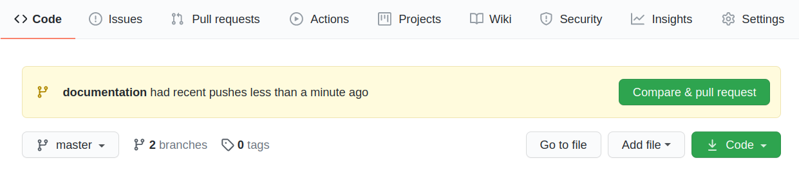
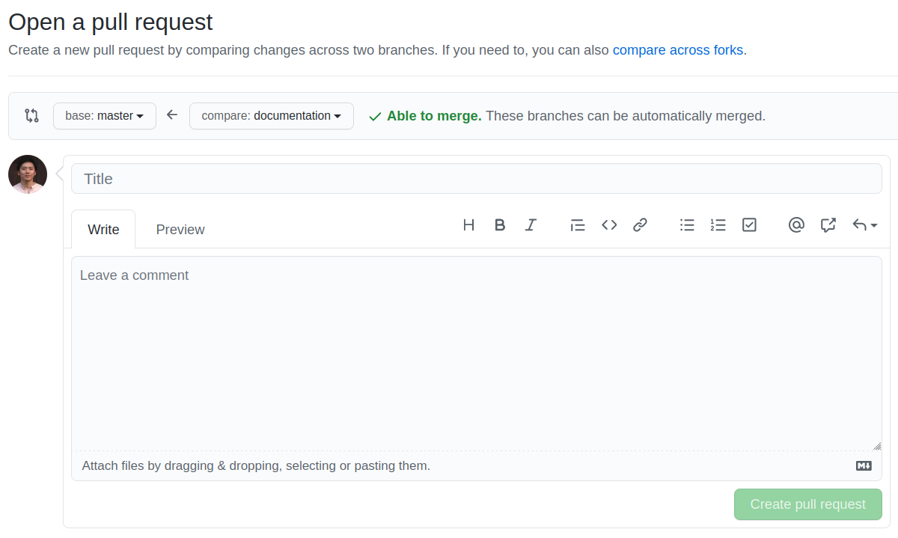

# Risk Factors of Suicide at the Societal Level: A Global Cross-country
Study
================

-   [Working Paper](https://docs.google.com/document/d/1pqrhyJhLlgvDlG8XqJwYnN_kGjQ7g7Gso5VAV6bhdWk/edit?usp=sharing) - not finished (feel free to comment!)

-   [Abstract](#abstract)
-   [Technical notes](#technical-notes)
    -   [Project structure](#project-structure)
    -   [R/RStudio workflow](#rrstudio-workflow)
    -   [Git/GitHub workflow](#gitgithub-workflow)
-   [Data Standardization](#data-standardization)
    -   [Country Codes](#country-codes)

*&lt;To update the README, please **edit the `README.Rmd`** file, not
`README.md`. Knitting the .Rmd file will output the .md file
automatically. This allows for automatically creating a table of
contents and more flexible inclusion of images and code.&gt;*

## Abstract

Suicide is a social risk, found more or less in every society of the
world. This study investigates the risk factors associated with suicide
at the societal-level. It extends state of the art research into more
countries with a more diverse set of modeled risk factors, in particular
looking at war, economic crisis, political regime and religious
affiliation at once. This comprehensive picture provides strong
explanatory evidence for international suicide rates and links to
theories of modernization and anomie. By including so many countries in
one sample, we find that social change remains an important risk factor
in suicides; however, this change is not one path toward organic
solidarity as imagined by Durkheim but more of a set of diverse paths
with varying risks of extremely competitive global capital flows leading
to abrupt (in the sense of human history) and dangerous forms of
industrialization and service sector expansions.

**Note**: The study started out as a replication of *Income inequality,
unemployment, and suicide: a panel data analysis of 15 European
countries* (Andrés 2005) and later developed into a broader extension of
this line of research, drawing on *Unemployment, global economic crises
and suicides: evidence from 21 OECD countries* (Huikari/Korhonen 2020)
among others.

## Technical notes

### Project structure

    ../suicide_replication
    +-- analysis
    +-- data
    +-- ext
    +-- output
    +-- results
    \-- src

(Based on Emily Riederer’s [*RMarkdown Driven
Development*](https://emilyriederer.netlify.app/post/rmarkdown-driven-development/))

-   `analysis`: R Markdown files that constitute the final narrative
    output.  
    *Recommended:* one separate file for each section/chapter
    (e.g. literature review, results) to avoid conflicts when merging
    from different branches (see [Git/GitHub
    workflow](#gitgithub-workflow) below).
-   `src`: R scripts that contain helper functions or other set-up tasks
    (e.g. data pulls).
-   `data`: Raw data – this folder should be considered “read-only”.
-   `output`: Intermediate data objects created in the analysis or
    scripts – typically saved as RDS files (with `saveRDS()` and
    `readRDS()`).
-   `ext`: Miscellaneous external files (e.g. images, style sheets).

### R/RStudio workflow

Regularly **update packages**.

**Use the [here](https://here.r-lib.org/) package to specify paths** to
files and folder instead of using `setwd()`, which is dependent on the
project’s location on your machine and the R Markdown file’s location
inside the project.

-   The top-level directory is the project folder
    (`suicide_replication`)
-   Use the `here()` function to build a path relative to the top-level
    directory in order to read or write a file.  
    E.g., `saveRDS(mtcars, here::here("output/mtcars.RDS"))` would save
    the `mtcars` dataset as a file named `mtcars.RDS` in the `output`
    folder.

If you discover an error in a data file, never modify it directly, but
instead write code to correct the value. ([*R4DS*, Chapter
30](https://r4ds.had.co.nz/r-markdown-workflow.html))

Give R Markdown code chunks informative and unique names
(e.g. `{r descriptive-stats}` instead of `{r}`) to help navigate and
allow for referencing and reusing code chunks throughout the document.

### Git/GitHub workflow

*Important: Do not commit and push directly to the `master` branch.*

Create GitHub issues to discuss problems, questions etc. or to list
to-dos.

Create **branches for separate tasks/issues** (e.g. `collect-data`,
`effect-plots`, `literature-review`):

-   Make sure to **switch to the `master` branch** before creating a new
    branch.
-   **Pull** before creating a new branch.

Regularly commit and push your work to the same named branch on the
server.  
(Remember to **pull** regularly, **esp. before committing changes**.)

**Open a Pull Request (PR)** on GitHub when you want to merge your
changes into `master`:

-   Make sure the branch is up-to-date with `master` prior to creating a
    PR:  
    `git pull origin master` in the R terminal.
-   On GitHub, click the **Compare & pull request** button to start
    creating a PR.  
    
-   Give the pull request a title. Optionally, leave a comment. Click
    **Create pull request**.  
    
-   Long will complete the merge.

## Data Standardization

All data files should be documented with a full citation, and the
citation should be placed in the shared Zotero group folder.

### Country Codes

We will follow the [International Organization for Standardization
(ISO)](https://en.wikipedia.org/wiki/List_of_ISO_3166_country_codes) of
countries using their 3-digit character codes. All countries in the data
we use must be classified into these “iso3c” codes to allow merging. The
package `countrycode` is ideal for this. It can read country information
in many formats and quickly convert them.

